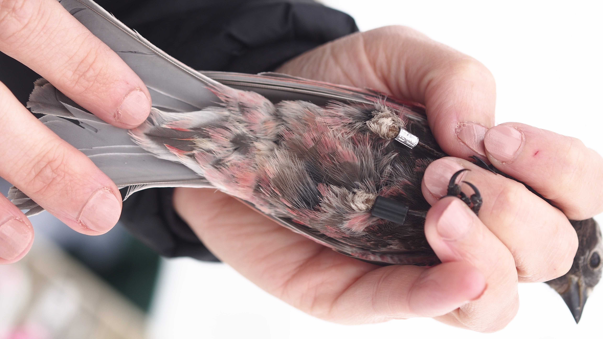

```{r setup, include=FALSE}
options(htmltools.dir.version = FALSE)
knitr::opts_chunk$set(echo = FALSE, fig.align = 'center', warning=FALSE, message=FALSE)
library(WILD6900)
# library(gganimate)
```

## Readings

> ### Kéry & Schaub 134-170

---
## Estimating abundance

#### Unbiased estimates of $\large N$ require estimating $\large p$

#### *Many* methods available:

- Mark-recapture  

- Removal sampling  

- Distance sampling  

- Double observer  

- N-mixture models

---
## Estimating abundance

#### Unbiased estimates of $\large N$ require estimating $\large p$

#### *Many* methods available:

- **Mark-recapture**  

- Removal sampling  

- Distance sampling  

- Double observer  

- N-mixture models


---
class: inverse, middle, center

# Capture-mark-recapture

---
## Capture-mark-recapture (CMR)

#### CMR includes a **wide** variety of related techniques and models  

--
#### Traditionally, CMR referred to methods of capturing, marking, and then recapturing individuals at some point in the future  

--
#### This results in a **capture-history** for each individual:  

##### Individual 1: $101101$  
##### Individual 2: $011001$  

???

Individual 1 was captured on occasions 1, 3, 4, and 6  

Individual 2 was captured on occasions 2,3, and 6. 

--
#### From the capture-histories, possible to estimate $\large p$

--
#### With $\large p$, possible to estimate $\large N$

$$\large N = \frac{C}{p}$$

---
## Capture-mark-recapture

#### From capture-histories, we can estimate:  

--
- abundance  

--
- detection probability  

--
- survival  

--
- movement  

--
- recruitment  

--
- individual growth  

--
- populations trends   

---
## Capture-mark-recapture


#### CMR methods are not restricted to physical captures and recaptures

```{r out.width=600}
knitr::include_graphics("figs/pelican.jpg")
```

???

Capture histories can be created from resighting marks that can be seen from a distance

Photo Credit: Rick Kimble/USFWS

---
## Capture-mark-recapture


#### CMR methods are not restricted to physical captures and recaptures

```{r out.width=600}

```

???

Capture histories can be created from automated systems that record ID's, like PIT tags

Image courtesy of: USFWS Mountain-Prairie via Wikimedia Commons

---
## Capture-mark-recapture


#### CMR methods are not restricted to physical captures and recaptures

```{r out.width=600}
knitr::include_graphics("https://upload.wikimedia.org/wikipedia/commons/3/37/Wild_Sumatran_tiger.jpg")
```

???

 Capture histories can be created from "natural marks", e.g. camera trapping

Image courtesy of: Arddu, via Wikimedia Commons

---
## Capture-mark-recapture


#### CMR methods are not restricted to physical captures and recaptures

```{r out.width=600}

knitr::include_graphics("https://upload.wikimedia.org/wikipedia/commons/2/2a/Grizzly_hair_snare_%28Northern_Divide_Grizzly_Bear_Project%29_%284428177124%29.jpg")
```

???

Capture histories can be created from "natural marks", e.g. genetic markers

Image courtesy of: GlacierNPS, via Wikimedia Commons

---
## Capture-mark-recapture


#### CMR methods are not restricted to physical captures and recaptures  

#### *What ties all of these methods together is that we have individual-level capture-histories*


