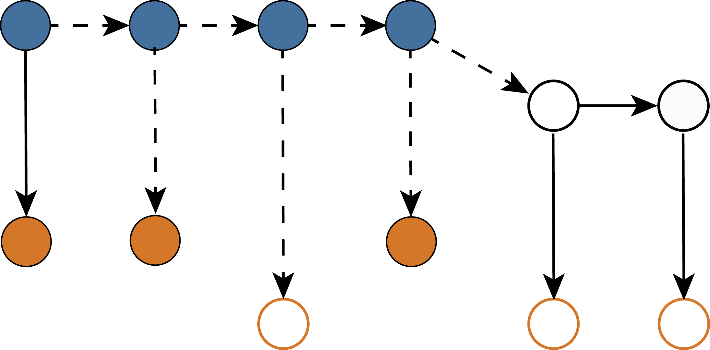
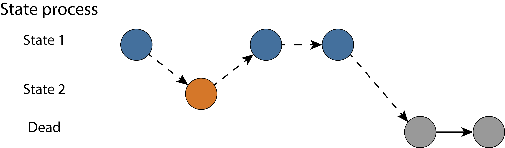
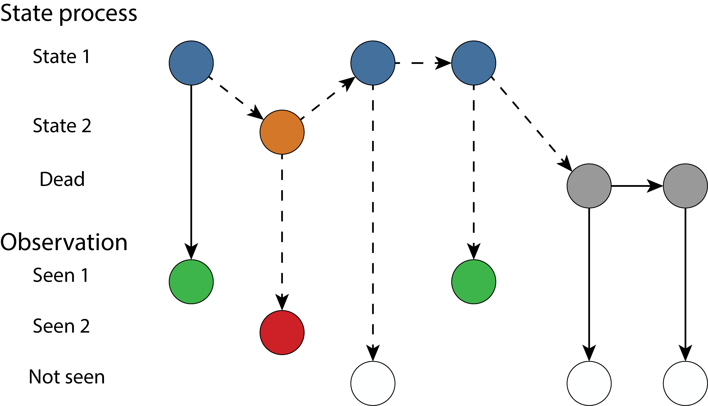
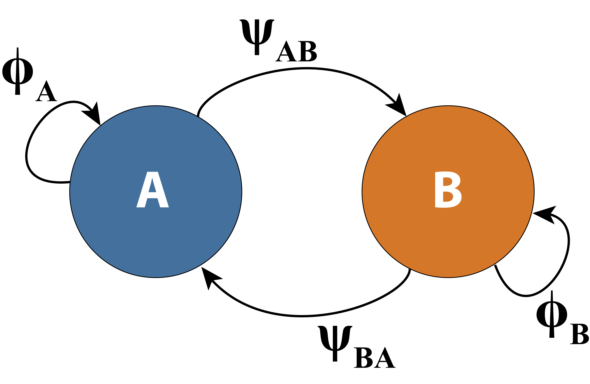

```{r setup, include=FALSE}
options(htmltools.dir.version = FALSE)
knitr::opts_chunk$set(echo = FALSE, fig.align = 'center', warning=FALSE, message=FALSE)
library(WILD6900)
# library(gganimate)
```

## Readings

> ### Kéry & Schaub 264-313

---
## What is a "state"

#### Alive/dead
- CJS model


--
#### Occupied/unoccupied
- Occupancy model


--
#### Geographic location (location $1, 2, ...,S$)

--
#### Un-infected/infected/dead

--
#### Age class

--
#### Any combination of above states*

.footnote[
*At least in theory
]

---
## Two states

#### State model

```{r out.width = "75%"}
knitr::include_graphics("figs/cjs1.png")
```

<br/>
<br/>
<br/>
<br/>
<br/>
<br/>
<br/>

$$\Large z_{i,t} \sim Bernoulli(z_{i,t-1}\phi)$$

---
## Two states

#### Observation model

```{r out.width = "75%"}

```

<br/>

$$\Large y_{i,t} \sim Bernoulli(z_{i,t}p)$$

---
## Three states

#### State model

```{r out.width = "75%"}

```

---
## Three states

#### State model

```{r out.width = "75%"}

```

---
## Three states - example

#### Movement between two sites

---
## Three states - example

#### Movement between two sites

```{r out.width="50%"}

```

- $\large \phi_A$: Probability alive at site A

- $\large \phi_B$: Probability alive at site B

- $\large \psi_{AB}$: Probability of moving from site A to site B

- $\large \psi_{BA}$: Probability of moving from site B to site A

---
## Three states - example

#### State model 

.left-column[
<br/>
<br/>
<br/>
#### True state at time *t*
]

.right-column[
<center>
#### True state at time *t + 1*
</center>
```{r}
library(kableExtra)
ms_df <- data.frame(state = c("Site A", "Site B", "Dead"),
                 A = c("\\(\\phi_A (1 - \\psi_{AB})\\)", 
                       "\\(\\phi_B \\psi_{BA}\\)", 
                       "0"),
                 B = c("\\(\\phi_A \\psi_{AB}\\)",
                       "\\(\\phi_B (1 - \\psi_{BA})\\)", 
                       "0"),
                 Dead = c( "\\(1 - \\phi_A\\)",
                           "\\(1 - \\phi_B\\)",
                           "1"))

names(ms_df) <- c("", "Site A", "Site B", "Dead")
ms_df %>%
  kable("html", align = 'c', escape = FALSE) %>%
  kable_styling(bootstrap_options = c("striped", "hover", "condensed", "responsive"), 
                full_width = TRUE, font_size = 14) 
```

]


---
## Three states - example

#### Observation model 

.left-column[
<br/>
<br/>
<br/>
#### True state at time *t*
]

.right-column[
<center>
#### Observation at time *t*
</center>
```{r}
library(kableExtra)
ms_df2 <- data.frame(state = c("Site A", "Site B", "Dead"),
                 A = c("\\(p_A\\)", 
                       "0", 
                       "0"),
                 B = c("0",
                       "\\(p_B\\)", 
                       "0"),
                 NS = c( "\\(1 - p_A\\)",
                           "\\(1 - p_B\\)",
                           "1"))

names(ms_df2) <- c("", "Site A", "Site B", "Not Seen")
ms_df2 %>%
  kable("html", align = 'c', escape = FALSE) %>%
  kable_styling(bootstrap_options = c("striped", "hover", "condensed", "responsive"), 
                full_width = TRUE, font_size = 14) 
```

]

---
## Three states - example

#### The data


```{r}
phiA <- 0.8
phiB <- 0.7
psiAB <- 0.3
psiBA <- 0.5
pA <- 0.7
pB <- 0.4
n.occasions <- 6
n.states <- 3
n.obs <- 3
marked <- matrix(NA, ncol = n.states, nrow = n.occasions)
marked[,1] <- rep(100, n.occasions)  
marked[,2] <- rep(60, n.occasions)
marked[,3] <- rep(0, n.occasions)

# Define matrices with survival, transition and recapture probabilities
# These are 4-dimensional matrices, with 
   # Dimension 1: state of departure
   # Dimension 2: state of arrival
   # Dimension 3: individual
   # Dimension 4: time

# 1. State process matrix
totrel <- sum(marked)
PSI.STATE <- array(NA, dim=c(n.states, n.states, totrel, n.occasions-1))
for (i in 1:totrel){
   for (t in 1:(n.occasions-1)){
      PSI.STATE[,,i,t] <- matrix(c(
      phiA*(1-psiAB), phiA*psiAB,     1-phiA,
      phiB*psiBA,     phiB*(1-psiBA), 1-phiB,
      0,              0,              1       ), nrow = n.states, byrow = TRUE)
      } #t
   } #i

# 2.Observation process matrix
PSI.OBS <- array(NA, dim=c(n.states, n.obs, totrel, n.occasions-1))
for (i in 1:totrel){
   for (t in 1:(n.occasions-1)){
      PSI.OBS[,,i,t] <- matrix(c(
      pA, 0,  1-pA,
      0,  pB, 1-pB,
      0,  0,  1       ), nrow = n.states, byrow = TRUE)
      } #t
   } #i

# Define function to simulate multistate capture-recapture data
simul.ms <- function(PSI.STATE, PSI.OBS, marked, unobservable = NA){
   # Unobservable: number of state that is unobservable
   n.occasions <- dim(PSI.STATE)[4] + 1
   CH <- CH.TRUE <- matrix(NA, ncol = n.occasions, nrow = sum(marked))
   # Define a vector with the occasion of marking
   mark.occ <- matrix(0, ncol = dim(PSI.STATE)[1], nrow = sum(marked))
   g <- colSums(marked)
   for (s in 1:dim(PSI.STATE)[1]){
      if (g[s]==0) next  # To avoid error message if nothing to replace
      mark.occ[(cumsum(g[1:s])-g[s]+1)[s]:cumsum(g[1:s])[s],s] <-
      rep(1:n.occasions, marked[1:n.occasions,s])
      } #s
   for (i in 1:sum(marked)){
      for (s in 1:dim(PSI.STATE)[1]){
         if (mark.occ[i,s]==0) next
         first <- mark.occ[i,s]
         CH[i,first] <- s
         CH.TRUE[i,first] <- s
         } #s
      for (t in (first+1):n.occasions){
         # Multinomial trials for state transitions
         if (first==n.occasions) next
         state <- which(rmultinom(1, 1, PSI.STATE[CH.TRUE[i,t-1],,i,t-1])==1)
         CH.TRUE[i,t] <- state
         # Multinomial trials for observation process
         event <- which(rmultinom(1, 1, PSI.OBS[CH.TRUE[i,t],,i,t-1])==1)
         CH[i,t] <- event
         } #t
      } #i
   # Replace the NA and the highest state number (dead) in the file by 0
   CH[is.na(CH)] <- 0
   CH[CH==dim(PSI.STATE)[1]] <- 0
   CH[CH==unobservable] <- 0
   id <- numeric(0)
   for (i in 1:dim(CH)[1]){
      z <- min(which(CH[i,]!=0))
      ifelse(z==dim(CH)[2], id <- c(id,i), id <- c(id))
      }
   return(list(CH=CH[-id,], CH.TRUE=CH.TRUE[-id,]))
   # CH: capture histories to be used
   # CH.TRUE: capture histories with perfect observation
   }

# Execute function
sim <- simul.ms(PSI.STATE, PSI.OBS, marked)
CH <- sim$CH

# Compute vector with occasion of first capture
get.first <- function(x) min(which(x!=0))
f <- apply(CH, 1, get.first)

# Recode CH matrix: note, a 0 is not allowed in WinBUGS!
# 1 = seen alive in A, 2 = seen alive in B, 3 = not seen
rCH <- CH          # Recoded CH
rCH[rCH==0] <- 3
```

- $1 =$ Seen alive at site A

- $2 =$ Seen alive at site B

- $3 =$ Not seen

--
```{r echo = TRUE}
head(rCH)
```

---
## Three states - example

#### The data

- $f =$ First capture occasion

```{r echo = TRUE}
tail(rCH)
tail(f)
```

---
## Three states - example

#### The likelihood
- The Bernoulli distribution describes the probability of one (of two) outcomes

--
- The categorical distribution describes the probability of one (of $N$) outcomes
    + $\Omega$ and $\Theta$ are matrices defining the state/observation probabilities   

--
$$\large z_{i, t+1}|z_{i,t} \sim categorical(\Omega_{z_{i,t},1:S})$$

$$\large y_{i, t}|z_{i,t} \sim categorical(\Theta_{z_{i,t},1:S})$$

---
## Analysis in JAGS

```{r eval = FALSE, echo = TRUE}
sink("ms.jags")
cat("
model {
  # Priors 
   phiA ~ dunif(0, 1)
   phiB ~ dunif(0, 1)
   psiAB ~ dunif(0, 1)
   psiBA ~ dunif(0, 1)
   pA ~ dunif(0, 1)
   pB ~ dunif(0, 1)
```

---
## Analysis in JAGS

```{r eval = FALSE, echo = TRUE}
  # Define state-transition and observation matrices
   # Define probabilities of state S(t+1) given S(t)
      ps[1,1] <- phiA * (1-psiAB)
      ps[1,2] <- phiA * psiAB
      ps[1,3] <- 1-phiA
      ps[2,1] <- phiB * psiBA
      ps[2,2] <- phiB * (1-psiBA)
      ps[2,3] <- 1-phiB
      ps[3,1] <- 0
      ps[3,2] <- 0
      ps[3,3] <- 1
```

---
## Analysis in JAGS

```{r eval = FALSE, echo = TRUE}
      # Define probabilities of O(t) given S(t)
      po[1,1] <- pA
      po[1,2] <- 0
      po[1,3] <- 1-pA
      po[2,1] <- 0
      po[2,2] <- pB
      po[2,3] <- 1-pB
      po[3,1] <- 0
      po[3,2] <- 0
      po[3,3] <- 1
```

---
## Analysis in JAGS

```{r eval = FALSE, echo = TRUE}
# Likelihood 
for (i in 1:nInd){
   # Define latent state at first capture
   z[i,f[i]] <- y[i,f[i]]
   for (t in (f[i]+1):nOcc){
      # State process: draw S(t) given S(t-1)
      z[i,t] ~ dcat(ps[z[i,t-1],])
      # Observation process: draw O(t) given S(t)
      y[i,t] ~ dcat(po[z[i,t],])
      } #t
   } #i
}
",fill = TRUE)
sink()
```

---
## Multi-state models

#### Very flexible
- Most capture-recapture models can be formulated as multi-state models

- Can accommodate many states

- Can include covariates and individual/temporal variation 

#### But complexity comes at a cost
- Data hungry

- Often not fully identifiable

- Computationally intensive
