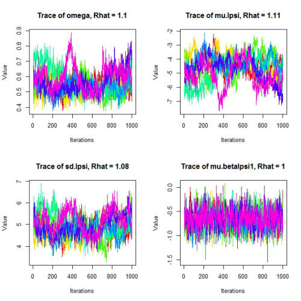

```{r setup, include=FALSE}
options(htmltools.dir.version = FALSE)
knitr::opts_chunk$set(echo = FALSE, fig.align = 'center', warning=FALSE, message=FALSE, fig.retina = 2)
library(WILD6900)
# library(gganimate)
```

## Readings

> Hobbs & Hooten 145-180

---
## From the joint distribution to the posterior

Remember from lecture 3 that the posterior distribution of random variable $\theta$ conditional on data $y$ is defined by Bayes theorem:  

$$\Large \underbrace{[\theta|y]}_{posterior\; distribution} = \frac{\overbrace{[y|\theta]}^{likelihood} \;\;\;\;\overbrace{[\theta]}^{prior}}{\underbrace{[y]}_{marginal\; distribution}}$$

--

#### We spent a fair about of time learning how to define the likelihood $\large [\theta, y]$ and the prior $\large [\theta]$  


--

#### But we gave only given a cursory overview to the denominator of Bayes theorem, the marginal distribution $\large [y]$ $^1$  

???

$^1$ This is for good reason. For all but the most simple problems (where we can use conjugate distributions or simple integration to estimate the posterior distribution), estimating the marginal distribution is not analytically possible. A model with four parameters will require solving a four-dimensional integral  

---
class: inverse, center, middle

# Markov chain Monte Carlo

---
## Markov chain Monte Carlo

#### In your own analyses, you will generally write out the model using a programming language understood by one of the common Bayesian software programs and then let the software fit the model  

--
- This can be done without really knowing much of anything about *how* the software fits the model  

--
- After this lecture, that's essentially the way we will operate for the remainder of the semester. 


--

#### But treating these software as a total black box is not a great idea  

- Having at least some idea what JAGS (or BUGS or Nimble) is doing to estimate the posterior distributions of parameters in your model will help you better understand if and when these programs are doing what you want $^1$

???

$^1$ There are different flavors of MCMC that are used behind the scenes in all modern Bayesian software, including JAGS, Bugs, Nimble, and Stan  

$^1$ That said, because this course focuses on the practice of Bayesian analyses rather than the theory, we will not go into a lot of details about MCMC  

---
## From the joint distribution to the posterior

#### Remember that the marginal distribution $\large [y]$ is what normalizes the joint distribution to ensure the posterior is a proper probability distribution $^1$  

```{r, fig.width=8, fig.height=5}

y <- 42
y_probs <- data.frame(lambda = 15:65,
                      pr_y = dpois(y, lambda = 15:65))

lik_profile <- ggplot(data = y_probs, aes(x = lambda, y = pr_y)) + geom_path(color = WILD6900_colors$value[WILD6900_colors$name == "primary"], size = 1.5) +
  scale_y_continuous(expression(paste("L(", lambda, "|y=42)"))) +
  scale_x_continuous(expression(lambda))


prior <- data.frame(lambda = seq(from = 15, to = 65, by = 0.25),
                    pr_lambda = dgamma(seq(from = 15, to = 65, by = 0.25), 40^2/6, 40/6))

prior_lik <- lik_profile + geom_path(data = prior, aes(x = lambda, y = pr_lambda),  color = WILD6900_colors$value[WILD6900_colors$name=="secondary"],
                                     linetype = "longdash", size = 1.5)

joint <- data.frame(lambda = seq(from = 15, to = 65, by = 0.25),
                    jnt_dist = dgamma(seq(from = 15, to = 65, by = 0.25), 40^2/6, 40/6) * 
                               dpois(42, seq(from = 15, to = 65, by = 0.25)))

prior_lik_joint <- prior_lik + geom_path(data = joint, aes(x = lambda, y = jnt_dist), linetype = "dotted", size = 1.5)

(prior_lik_joint <- prior_lik_joint + geom_area(data = joint, aes(x = lambda, y = jnt_dist), linetype = "dashed",
  fill = WILD6900_colors$value[WILD6900_colors$name=="secondary"]))


```

---
## From the joint distribution to the posterior

#### Remember that the marginal distribution $\large [y]$ is what normalizes the joint distribution to ensure the posterior is a proper probability distribution $^1$  

- Without the marginal distribution, parameters cannot be treated as random variables $^1$  
<br/>


--
This issue of estimating the marginal distribution is what limited the application of Bayesian methods to practical problems from it's inception until the 1990's  
<br/>

--
Progress was only made once statisticians started developing methods to learn about the posterior distribution by sampling *from the posterior distributions*  

???

$^1$ i.e., sums to 1

$^1$ And therefore we cannot conduct a truly Bayesian analysis  


---
## Learning about the posterior by sampling from it

#### How can we draw samples from a distribution that we don't know?  

--

#### Remember from lecture 3 that we do know something about the distribution of each parameter in our model, namely the joint distribution: 

$$\Large [\theta|y] \propto [y|\theta][\theta]$$


--

#### By taking many many samples from the joint distribution, we can learn about its shape  

---
## Learning about the posterior by sampling from it

#### If this seems confusing, think about learning about the shape of a probability distribution by taking many samples from it $^1$

```{r echo = TRUE, fig.height=2, fig.width=4}
norm_df <- data.frame(samples = rnorm(5000))    # Generate samples from distribution
```

```{r fig.height=3, fig.width=5}
ggplot(norm_df, aes(samples)) + geom_histogram(fill = WILD6900_colors$value[WILD6900_colors$name == "primary"]) + annotate("text", x = 0, y = 750, label = paste("Sample mean = ", round(mean(norm_df$samples),2))) + annotate("text", x = 0, y = 675, label = paste("Sample variance = ", round(sd(norm_df$samples),2))) 
```

???

$^1$ This is not exactly what we do in Bayesian methods but hopefully it helps understand the concept of learning about a probability distribution via sampling  

---
## Learning about the posterior by sampling from it

#### In most modern Bayesian analysis, estimating posterior distributions is done using *Markov chain Monte Carlo* (MCMC) methods  

--

#### MCMC is an algorithm that uses the joint distribution to sample values of each random variable in proportion to their to their probability  

--

#### Essentially, MCMC takes the likelihood profile $^1$, weights it by the prior $^2$, and then normalizes the joint distribution so it is a proper probability distribution  

???

 $^1$ which, remember, is not normalized
 
 $^2$ which, remember, is the joint distribution
 
---
## Implementing a simple MCMC

#### If that seems a little confusing, it should be come clear if go through the steps of the MCMC applied to a simple model with a single parameter $\large \theta$  


--

#### Let's return to our survival example where we tracked individuals using GPS collars and at the end of the study, recorded the number of individuals that were still alive  

- We will expand the example to include 5 study sites and assume we tracked 20 individuals at each site  


--

#### We want to estimate $\large \phi$, the probability of survival from the beginning to the end of the study $^1$  

???

$^1$ which we will further assume is constant across all 5 sites  

---
## Implementing a simple MCMC

#### Before we can implement the MCMC algorithm, we have to choose an appropriate likelihood distribution to describe our system  


--

#### In this case, we want to know the probability of getting $\large n$ "successes" (alive at the end of the study) out of $\large N$ "tries" (individuals alive at the beginning of the study)  

--
- A natural choice for this likelihood is the binomial distribution  


---
## Implementing a simple MCMC

#### Simulate data, assuming the true survival probability is $\large 40\%$:

```{r, echo = TRUE}
n.sites <- 5 # Number of sites
N <- 20      # Number of individuals tracked at each site
phi <- 0.4   # True survival probability

(n <- rbinom(n = n.sites, size = N, prob = phi))
```

---
## Implementing a simple MCMC

#### Next, we need to define the prior distribution  

--

#### We could choose a uniform prior but as we have already learned, that's probably not the best choice  


--

#### Assume we know survival is probably $\gt \sim 20\%$ and $\lt \sim 50\%$  

- A reasonable prior to represent this knowledge might be $beta(2,4)$

```{r fig.width=6, fig.height=3}

beta_df <- data.frame(p = seq(0, 1, 0.01),
                      value = dbeta(seq(0, 1, 0.01), 2, 4),
                      dist = rep(c("Prior"), 101))

(p <- ggplot() + geom_path(data = beta_df, aes(x = p, y = value, group = dist, linetype = dist), size = 1.5) +
  scale_y_continuous("Density") +
  scale_linetype_manual(values = c("solid", "dotted")))

```

---
## Implementing a simple MCMC

#### To make our lives easier, let's also define a function to estimate the (log) joint distribution $^1$ conditional on our data and prior:

```{r, echo = TRUE}
joint <- function(data, N, phi, a, b){
  ll <- sum(dbinom(data, size = N, prob = phi, log = TRUE)) + 
        dbeta(x = phi, shape1 = a, shape2 = b, log = TRUE)
  return(ll)
}
```

--

Make sure you understand exactly what this function is doing! 

???

$^1$ We work with log probabilities to avoid numerical problems when the actual probabilities get really small

---
class: inverse, class, middle

# MCMC: basic steps

---
## MCMC: basic steps

#### Once we have our data and defined a likelihood function and a prior distribution, the basics steps of the MCMC algorithm $^1$ are:  

--

0) Choose an initial value for $\theta$ (call it $\theta^1$)  

--

1) Propose a new value $\theta^*$ from a proposal distribution  

--

2) Compute probability of accepting $\theta^*$ using the joint distributions evaluated at $\theta^*$ and $\theta^1$  

--

3) Accept $\theta^*$ (i.e., $\theta^{2} = \theta^*$) with the probability estimated in step 2, otherwise retain the previous value (i.e., $\theta^{2} = \theta^{1}$)  

???

$^1$ We are technically describing the steps of a specific type of MCMC called *accept-and-reject* sampling. There are other types of MCMC samplers that we will not describe here. For additional references on types of samplers, refer to Hobbs & Hooten chapter 7

---
## MCMC: basic steps

Steps 1-3 are repeated many times, resulting in $K$ samples of $\theta$  

- This collection of $\theta$ values is referred to as a *chain*  

- Steps 2 and 3 ensure that the values of $\theta$ is our chain are sampled in proportion to their probability in the posterior distribution $[\theta|y]$  

- By collecting a large number of samples of $\theta$ is proportion to their probability in $[\theta|y]$, we can define the posterior distribution  


---
## MCMC: basic steps

#### To clarify what's happening in each of these steps, we'll work through each one using our example data  

---
## MCMC: basic steps

### Step 0: Choose an initial value

#### The first step is to choose an initial value for the chain  

--

#### The exact value typically isn't too important but should be consistent with the probability distribution that defines the parameter $^1$  

--

#### In some cases, it can be advantageous to choose initial values that are at least reasonable approximations of the parameter value (but for simple models it shouldn't matter much)  

???

$^1$ In our case, $\phi$ is a probability so our initial value should be between 0 and 1  

---
## MCMC: basic steps

### Step 0: Choose an initial value

#### For our example, we'll just choose a random number between 0 and 1 using `runif(1)`  

- This will give different values each time we run the algorithm, which is a good way to investigate whether the posterior estimate is sensitive to the initial values $^1$ 

```{r, echo = TRUE}
set.seed(123456)
(init <- runif(1))
```

???

$^1$ if the posterior is sensitive to the initial value, that could indicate a problem or simply that you need to run the chain longer. We'll explore how to diagnose problems in our chains shortly  

---
## MCMC: basic steps

### Step 1: Propose a new value

#### All MCMC algorithms develop chains by proposing a new value of $\large \theta$ (denoted $\large \theta^*$) from some *proposal distribution*  

--

#### There are different ways to formulate proposal distributions but in most applications, the proposal $\large \theta^*$ is *dependent* on $\large \theta^{k-1}$  

#### That is: 

$$\Large [\theta^*|\theta^{k-1}]$$ 

---
## MCMC: basic steps

### Step 1: Propose a new value

#### For example, we could use a normal proposal distribution:

$$\Large \theta^* \sim Normal(\theta^{k-1}, \sigma^2)$$

---
## MCMC: basic steps

### Step 1: Propose a new value

#### Using a normal proposal distribution, $\large \theta^*$ can be any real number but will, on average, tend to be close to $\large \theta^{k-1}$  

--

#### How close $\large \theta^*$ is to $\large \theta^{k-1}$ is determined by $\large \sigma^2$, which is referred to as the *tuning parameter*  

--
- $\sigma^2$ determines the frequency that proposals are accepted  

--
- Larger values will result in more frequent rejections, smaller values will result in more acceptances. 

---
## MCMC: basic steps

### Step 1: Propose a new value

#### The normal distribution implies that $\large \theta$ can be any real number, which makes sense for some parameters but not for our example  

--

#### We could instead use a beta distribution and use moment matching to define $\large \alpha$ and $\large \beta$ in terms of $\large \theta^{k-1}$ (the mean) and $\large \sigma^2$:

$$\theta^* \sim beta\Bigg(\theta^{k-1}\bigg(\frac{\theta^{k-1}(1-\theta^{k-1})}{\sigma^2}-1\bigg), (1-\theta^{k-1})\bigg(\frac{\theta^{k-1}(1-\theta^{k-1})}{\sigma^2}-1\bigg)\Bigg)$$

---
## MCMC: basic steps

### Step 1: Propose a new value

#### Again, let's create a function to generate proposals:

```{r echo=TRUE}
proposal <- function(phi, sigma2){
  alpha <- phi * ((phi * (1 - phi) / sigma2) - 1)
  beta <- (1 - phi) * ((phi * (1 - phi) / sigma2) - 1)
  
  proposal <- rbeta(n = 1, shape1 = alpha, shape2 = beta)
  return(proposal)
}
```

---
## MCMC: basic steps

### Step 2: Estimate acceptance probability

### With the proposal $\large \theta^*$, we have to decide whether to accept this as our new value of $\large \theta^k$  

- If we accept $\theta^*$, $\theta^{k} = \theta^*$  

- If we reject it, $\theta^{k} = \theta^{k-1}$  


--

#### We accomplish this using *Metropolis updates*, a very clever way of ensuring that our samples of $\large \theta$ occur in proportion to their probability in the posterior distribution  

---
## MCMC: basic steps

### Step 2: Estimate acceptance probability

#### Remember that the support for the proposal conditional on the data is:

$$\Large [\theta^*|y] = \frac{[y|\theta^*][\theta^*]}{[y]}$$

#### The support for the current value is:

$$\Large [\theta^{k-1}|y] = \frac{[y|\theta^{k-1}][\theta^{k-1}]}{[y]}$$

--

These, of course, are the posterior probabilities of $\theta^*$ and $\theta^{k-1}$

---
## MCMC: basic steps

### Step 2: Estimate acceptance probability

#### At first, this doesn't seem to have gotten us very far  

- We started out saying that the hard part was finding $[y]$ and here it is again  


--

#### But because $\large [y]$ does not depend on $\large [\theta]$, it cancels out if we take the ratio of the two probabilities:

$$\Large R = \frac{[y|\theta^*][\theta^*]}{[y|\theta^{k-1}][\theta^{k-1}]} \tag{1}$$

---
## MCMC: basic steps

### Step 2: Estimate acceptance probability

#### Equation 1 tells us the *relative* probability of the proposed value (relative to the current value), i.e., which value is more probable $^1$  

--

#### In Metropolis updating we accept $\large \theta^*$ whenever $\large R \geq 1$, i.e. when $\large \theta^*$ is more probable than $\large \theta^{k-1}$   

--

At first blush, you might assume that we reject  $\large \theta^*$ when $\large R \lt 1$  

- However, if we did this, we would rarely sample values of $\theta$ in the tails $^1$ 

- Instead of automatically rejecting  $\theta^*$ when $R \lt 1$, we treat $R$ as a probability and we keep $\theta^*$ with probability $R$  


???

$^1$ this is not exactly the way we estimate $R$ when we use a non-normal proposal distribution but we won't worry about that for now  

$^1$ Values in the tails of the posterior are by definition not very probable but we still want to occasionally sample these values so that we can accurately define the full posterior  

---
## MCMC: basic steps

### Step 2: Estimate acceptance probability

We can now use our custom functions to create the chain. First, we will set up the parameters of the sampler:

```{r echo = TRUE}
n.samples <- 10000    # Number of samples to draw
sigma2 <- 0.015       # Tuning parameter

posterior <- data.frame(iteration = 1:n.samples, 
                        phi = rep(NA, n.samples),    # Empty vector to store samples of phi
                        accept = rep(0, n.samples))  # Empty vector to keep track of acceptance 

phi <- init     # Initial value
```

---
## MCMC: basic steps

### Step 2: Estimate acceptance probability

Next, we run the sampler:

```{r echo = TRUE}
for(i in 1:n.samples){
  phi.cand <- proposal(phi = phi, sigma2 = sigma2)   ## Proposal
  
  l.R <- (joint(data = n, N = 20, phi = phi.cand, a = 2, b = 4) - ## log(R)
            joint(data = n, N = 20, phi = phi, a = 2, b = 4))
  
  R <- min(1, exp(l.R))   ## R
  
  if(runif(1) < R){
    phi <- phi.cand
    posterior$accept[i] <- 1
  }
  
  posterior$phi[i] <- phi
}
```

---
## MCMC: basic steps

### Step 3: Summarizing and visualizing the chain

The `phi` column in the `posterior` data frame now contains `r n.samples` samples from the posterior distribution of $\phi$  

We can use these samples to characterize the posterior distribution without having had to do any integration!  

For example, we can plot the posterior distribution:

```{r echo = TRUE, fig.width=5, fig.height=2.5}
ggplot(posterior, aes(x = phi)) + geom_density(size = 1.5) +
  scale_x_continuous(expression(phi))
```

---
## MCMC: basic steps

### Step 3: Summarizing and visualizing the chain

#### We can also create a **trace plot** showing values of the chain at each iteration $^1$

```{r echo = TRUE, fig.width=5, fig.height=3}
ggplot(posterior, aes(x = iteration, y = phi)) + geom_path() +
  scale_y_continuous(expression(phi))
```

???

$^1$ Trace plots can be very useful for diagnosing the behavior the chains, as we will see shortly

---
## MCMC: basic steps

### Step 3: Summarizing and visualizing the chain

#### Or find the mean (remember that the true value in our simulation was $\large 0.4$):

```{r echo = TRUE}
mean(posterior$phi)
```

Pretty close (that a good sign that our Metropolis sampler did what we wanted it to do!)

---
## MCMC: basic steps

### Step 3: Summarizing and visualizing the chain

#### We can also estimate quantiles:

```{r echo = TRUE}
quantile(posterior$phi)
```

Quantiles are useful for determining the 95% *credible intervals* of the posterior: $^1$

```{r echo = TRUE}
quantile(posterior$phi, probs = c(0.025, 0.975))
```

This allows us to make statements like "there is a 95% chance that $\phi$ is between `r round(quantile(posterior$phi, probs = 0.025),2)` and `r round(quantile(posterior$phi, probs = 0.975),2)`" $^2$

???

$^1$ i.e., the range of parameter values within which 95% of the posterior mass occurs  

$^2$ Compare the ease of credible interval estimation and the intuitive interpretation to the estimation/interpretation of frequentest 95% confidence intervals  

---
## Multiple chains

#### So far, we have assumed that our MCMC is composed of just a single chain  

#### In most applications, we run multiple chains for each parameter $^1$

```{r echo = FALSE, fig.height=4, fig.width=6}
chains <- data.frame(iteration = rep(seq(1:n.samples), 3),
                     chain = rep(c("1", "2", "3"), each = n.samples),
                     phi = sample(posterior$phi[10:n.samples], n.samples * 3, replace = TRUE))

ggplot(chains, aes(x = iteration, y = phi, color = chain)) + geom_path() +
  scale_color_manual(values = WILD6900_colors$value[WILD6900_colors$name %in% c("primary", "warning", "danger")])
```
???

$^1$ In principle, there is nothing wrong with just having a single chain if the samples from that chain accurately characterize the posterior. However, with only a single chain, it can be difficult to determine whether the sample *do* accurately characterize the posterior. As we will see shortly, running multiple chains aides diagnosing whether the model is well-behaved. 

---
## Multiple parameters

#### What happens if our model contains multiple parameters?  

- In most models, we need to find the marginal distributions of parameters that are part of multivariate joint distributions  

--
- To do this, we rely on the conditional relationships defined by the Bayesian network $^1$ 

```{r out.width=150}

```

--
$$\Large [z, \alpha, \sigma^2, \xi^2|y] \propto \underbrace{[y|z, \xi^2]}_a \underbrace{[z|g(\alpha, x), \sigma^2]}_b \underbrace{[\alpha]}_c \underbrace{[\sigma^2]}_d \underbrace{[\xi^2]}_e$$

???

$^1$ In this example, imagine the state variables $z$ are the body weight of some organisms, which are influenced by some covariate $x$. So the $z$ are a deterministic function of $x$ and parameter $\alpha$ and process error $\sigma^2$. Our measurements $y$ are a function of the true weights and measurement error $\xi^2$. 

---
## Multiple parameters

How do we develop a sampler for all of the random variables in this model?  
<br/>

--
We start by determining the conditional posterior distribution of each parameter

- the conditional posterior is defined by all of the nodes going to/from the parameter of interest

- all other nodes are ignored

- all parameters other than the parameter of interest are treated as **known constants**

---
## Multiple parameters

For $z$, the conditional posterior is: $^1$
```{r out.width=300}

```

--
$$\Large [z|.] \propto \underbrace{[y|z, \xi^2]}_a \underbrace{[z|g(\alpha, x), \sigma^2]}_b$$

???

$^1$ The $[z|.]$ notation is used to state that all parameters other than $z$ are treated as known constants

Distributions c-e are not included because they contain no information that is not contained in a & b

---
## Multiple parameters

For $\alpha$, the conditional posterior is: 

```{r out.width=200}

```

$$\Large [\alpha|.] \propto \underbrace{[z|g(\alpha, x), \sigma^2]}_b \underbrace{[\alpha]}_c$$

???

On your, write out the conditionals for $\sigma^2$ and $\xi^2$. Why do we not need conditionals for $y$ and $x$?

---
## Multiple parameters

The full-conditionals gives us a set of univariate distributions for sampling each random variable:  

$$\Large [z|.] \propto \underbrace{[y|z, \xi^2]}_a \underbrace{[z|g(\alpha, x), \sigma^2]}_b$$

$$\Large [\alpha|.] \propto \underbrace{[z|g(\alpha, x), \sigma^2]}_b \underbrace{[\alpha]}_c$$

$$\Large [\sigma^2|.] \propto \underbrace{[z|g(\alpha, x), \sigma^2]}_b \underbrace{[\sigma^2]}_d$$

$$\Large [\xi^2|.] \propto \underbrace{[y|z, \xi^2]}_a \underbrace{[\xi^2]}_e$$

---
## Multiple parameters

To construct an MCMC for this model, we use the same steps as for the single-parameter model, except at each iteration, we sample values from each conditional distribution in sequence  
<br/>

--
- As we move through the set, we use the updated parameters from the previous conditionals in the sequence in the RHS of subsequent conditionals $^{1,2}$  

???

$^1$ so in our example, we would propose a new value $z^*$ (actually each $z$ since we have one for each individual), accept or reject $z^*$ (either $z^k = z^*$ or $z^k = z^{k-1$), then use $z^k$ on the RHS when we propose $\alpha^*$, and so on

$^2$ we can sample in any order as long as we go in the same sequence for each iteration. In other words, it doesn't matter is we sample $\alpha$ first or last in the sequence as long we always sample in the same sequence

---
class: inverse, middle, center

# Evaluating Markov chains

---
## Evaluating Markov chains

#### MCMC is an enormously useful algorithm for finding the posterior distributions of random variables  


--
#### But it does not always work :(  


--
#### For any model, it is **critical** to evaluate the chains to determine whether you can trust inferences from the model

---
## Evaluating Markov chains

The most important characteristic of MCMC chains is **convergence**  

--
- Convergence occurs when the accumulated samples accurately characterize the posterior distribution of a parameter


--

Once a chain has converged, adding more samples will not meaningfully change the shape or moments of the posterior distribution  

--
- At this point, a chain is *stationary* because more samples will not cause it to "move" $^1$

```{r fig.height=3, fig.width=8}
a1 <- ggplot(posterior[1:100,], aes(x = iteration, y = phi)) + 
  geom_path(color = WILD6900_colors$value[WILD6900_colors$name=="primary"]) +
  scale_y_continuous(expression(phi)) + theme(axis.title.x = element_blank(), axis.text.x = element_blank())

a2 <- ggplot(posterior[1:100,], aes(x = phi)) + geom_density() +
  scale_x_continuous(expression(phi)) + theme(axis.title.x = element_blank(), axis.text.x = element_blank())

b1 <- ggplot(posterior[1:500,], aes(x = iteration, y = phi)) + 
  geom_path(color = WILD6900_colors$value[WILD6900_colors$name=="primary"]) +
  scale_y_continuous(expression(phi)) + theme(axis.title.x = element_blank(), axis.text.x = element_blank())

b2 <- ggplot(posterior[1:500,], aes(x = phi)) + geom_density() +
  scale_x_continuous(expression(phi)) + theme(axis.title.x = element_blank(), axis.text.x = element_blank())

c1 <- ggplot(posterior[1:5000,], aes(x = iteration, y = phi)) + 
  geom_path(color = WILD6900_colors$value[WILD6900_colors$name=="primary"]) +
  scale_y_continuous(expression(phi)) + theme(axis.title.x = element_blank(), axis.text.x = element_blank())

c2 <- ggplot(posterior[1:5000,], aes(x = phi)) + geom_density() +
  scale_x_continuous(expression(phi)) + theme(axis.title.x = element_blank(), axis.text.x = element_blank())

d1 <- ggplot(posterior, aes(x = iteration, y = phi)) + 
  geom_path(color = WILD6900_colors$value[WILD6900_colors$name=="primary"]) +
  scale_y_continuous(expression(phi)) + theme(axis.title.x = element_blank(), axis.text.x = element_blank())

d2 <- ggplot(posterior, aes(x = phi)) + geom_density() +
  scale_x_continuous(expression(phi)) + theme(axis.title.x = element_blank(), axis.text.x = element_blank())

cowplot::plot_grid(a1, b1, c1, d1, a2, b2, c2, d2, 
                   labels = c("1A)", "2A)","3A)", "4A)",
                              "1B)", "2B)", "3B)", "4B)"),
                   nrow = 2)

```

???

$^1$ Notice in figure 1a that the chain starts well above the true survival probability and it takes several iterations for the chains to move from the arbitrary initial value to samples that are consistent with the posterior distribution. In our example, that transition occurs relatively quickly so our posterior estimates based on the full chain isn't particularly influenced by our starting values.  

In more complicated models, it may take many more iterations for chains to move from the initial values to the stationary distribution. We generally don't want these samples to influence our inference so it is common to discard these initial values as **burn-in**. Often, you can just select a reasonably large number of samples (e.g., 5000-10000), tell JAGS to discard these as burn-in, then inspect the trace plots to check that this was enough. In other cases, you can just set burn-in as 0 in JAGS and then discard some number of iterations manually after looking at the trace plots.  


---
## Evaluating convergence

#### There are two main ways to assess convergence: visually and using formal diagnostic tests  


--

Visual evaluation is done using trace plots  

- Chains that have not converged will "wander" 


```{r out.width = 300}

```
  
???

$^1$ Mixing means that the chains are able to efficiently explore the full posterior, meaning they can explore the parameter space without getting stuck or having to slowly wander. Poorly mixing chains will generally exhibit high auto correlation, that is a high degree of dependence between a sample and the previous sample. Highly auto correlated chains require more samples to fully characterize the posterior  

In trace plots, well-mixing chains will have a "grassy lawn" look

---
## Evaluating convergence

There are two main ways to assess convergence: visually and using formal diagnostic tests  
<br/>

--
Formal diagnostic testing is commonly done using the **Gelman-Rubin diagnostic**, denoted $\hat{r}$  

--
- when chains have not converged, variance among chains $>$ variance within chains

- when chains have converged, variance among chains $=$ variance within chains

--
- $\hat{r}$ is essentially the ratio of among:within chain variance so $\hat{r} \approx 1$ indicates convergence

- values much greater than 1 indicate lack of convergence (usually $\hat{r} \leq 1.1$ is used as a threshold)


---
## Improving convergence 

Two issues can cause chains to not converge:  

--
1) Too few samples  

--
2) Lack of identifiability  

---
## Improving convergence

If too few samples have been accumulated, the chain will not accurately represent the full posterior  
<br/>

```{r fig.height=3, fig.width=5}
ggplot(posterior[1:100,], aes(x = iteration, y = phi)) + 
  geom_path(color = WILD6900_colors$value[WILD6900_colors$name=="primary"]) +
  scale_y_continuous(expression(phi))
```

--
**Solution** - continuing sampling! 


---
## Improving convergence

If too few samples have been accumulated, the chain will not accurately represent the full posterior  
<br/>

**Solution** - continuing sampling! 

```{r fig.height=3, fig.width=5}
ggplot(posterior, aes(x = iteration, y = phi)) + 
  geom_path(color = WILD6900_colors$value[WILD6900_colors$name=="primary"]) +
  scale_y_continuous(expression(phi))
```

---
## Improving convergence 

Solving lack of identifiability is harder  
<br/>

--
- reduce model complexity  
<br/>

--
- collect more data  
<br/>

--
- more informative priors $^1$  
<br/>

--
- increase [adaptation phase](http://www.mikemeredith.net/blog/2016/Adapt_or_burn.htm) $^2$  
<br/>

--
- transformations can sometimes help  

???

$^1$ A common cause of non-identifiability is when two parameters trade-off, such that different combinations give the same likelihood. One example is when both $N$ and $p$ are unknown in the binomial distribution - the same number of "successes" can be predicted by high $N$ and low $p$ vs. low $N$ and high $p$. In this case, incorporating information about $p$ via the prior can help identify $N$ (or vice versa).  

$^2$ Most MCMC software (JAGS, Bugs, etc) use an adaptive phase,  during with the samplers used by the model may modify their behavior for increased efficiency. This is usually done behind the scenes but as highlighted in the linked post, being aware of what the software is doing can be useful for improving mixing  
