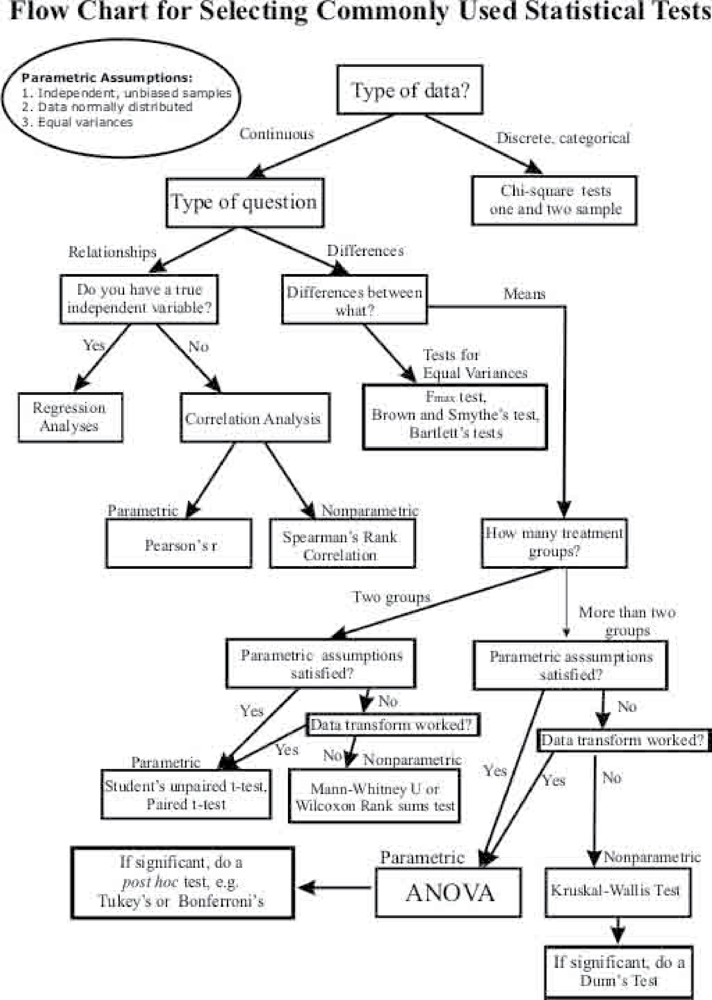

```{r setup, include=FALSE}
options(htmltools.dir.version = FALSE)
knitr::opts_chunk$set(echo = FALSE, fig.align = 'center', warning=FALSE, message=FALSE)
library(WILD6900)
library(gganimate)
```

## Readings

> ### Kéry & Schaub 48-55

---
# Statistics cookbook

```{r out.width="50%"}

```

---
class: inverse, center, middle

# From linear models to GLMs

---
# Linear models
<br/>
<br/>
$$\Large response = deterministic\; part+stochastic\; part$$ 
<br/>
<br/>

--
$$\underbrace{\LARGE \mu_i = \beta_0 + \beta_1 \times x_i}_{Deterministic}$$
<br/>
<br/>

--
$$\underbrace{\LARGE y_i \sim normal(\mu_i, \tau)}_{Stochastic}$$  

???

Note that the deterministic portion of the model has the same form as the equation for a line: $y = a + b \times x$, which is why we call these linear models

---
class: inverse, middle, center

# Linear models under the hood
## Variations on the determinstic model

---
# A simple linear model: the t-test
<br/>
<br/>
<br/>

$$\LARGE \mu_i = \beta_0 + \beta_1 \times x_i$$
<br/>
<br/>

--
$$\LARGE x_i \in [0,1]$$

---
## Under the hood: The t-test

$$\begin{bmatrix}
    \mu_1 \\
    \mu_2 \\
    \mu_3 \\
    .\\
    .\\
    .\\
    \mu_N
\end{bmatrix} = \begin{bmatrix}
    1 & x_1\\
    1 & x_2\\
    1 & x_3\\
    . \\
    . \\
    . \\
    1 & x_N
\end{bmatrix} \times \begin{bmatrix}
    \beta_0\\
    \beta_1 
\end{bmatrix}$$

<br/>
<br/>

--
$$\LARGE \mu_1 = \beta_0 \times 1 + \beta_1 \times x_1$$
$$\LARGE \mu_2 = \beta_0 \times 1 + \beta_2 \times x_1$$

---
## Under the hood: The t-test


```{r eval = FALSE, echo = TRUE}
model.matrix(lm(mpg ~ am, data = mtcars))[c(3,1,5),]
```

```{r eval = TRUE, echo = FALSE}
mtcars2 <- mtcars
mtcars2$cyl <- as.factor(mtcars2$cyl)
mtcars2$am <- as.factor(mtcars2$am)
model.matrix(lm(mpg ~ am, data = mtcars2))[c(3,1,5),]
```

--
### $\LARGE \beta_0$ is the mean mpg for automatic transmissions

--
### $\LARGE \beta_1$ is the *difference* between automatic and manual transmissions

???

This is called the *effects* parameterization

---
## Under the hood: The t-test

```{r eval = FALSE, echo = TRUE}
lm(mpg ~ am, data = mtcars)
```


```{r echo = FALSE}
mod <- broom::tidy(lm(mpg ~ am, data = mtcars2))
knitr::kable(mod, format = "html")
```

---
## Under the hood: The t-test

```{r eval = FALSE, echo = TRUE}
model.matrix(lm(mpg ~ as.factor(am) - 1, data = mtcars))[c(3,1,5),]
```

```{r eval = TRUE, echo = FALSE}
model.matrix(lm(mpg ~ am - 1, data = mtcars2))[c(3,1,5),]
```

--
### $\LARGE \beta_0$ is the mean mpg for automatic transmissions

--
### $\LARGE \beta_1$ is the mean mpg for manual transmissions

???

This is called the *means* parameterization  

A more compact way to write this model would be $\mu_i = \beta_{0[j]}$. Instead of $\beta_0$ (intercept) and $\beta_1$ (slope), we essentially have one intercept for each factor level  

---
## Under the hood: The t-test

```{r eval = FALSE, echo = TRUE}
lm(mpg ~ as.factor(am) - 1, data = mtcars)
```

```{r echo = FALSE}
mod <- broom::tidy(lm(mpg ~ am - 1, data = mtcars2))
knitr::kable(mod, format = "html")
```

---
# The t-test becomes an ANOVA

<br/>
<br/>
<br/>

$$\LARGE y_i = \beta_0 + \beta_{1[j]} \times x_i$$
<br/>
<br/>

--
$$j \in [1,2,3,...,J-1]$$

$$\LARGE x_i \in [0,1]$$

---
## Under the hood: ANOVA

```{r eval = FALSE, echo = TRUE}
model.matrix(lm(mpg ~ as.factor(cyl), data = mtcars))[c(3,1,5),]
```

```{r eval = TRUE, echo = FALSE}
model.matrix(lm(mpg ~ cyl, data = mtcars2))[c(3,1,5),]
```

--
### $\LARGE \beta_0$ is the mean mpg for 4-cylinders

--
### $\LARGE \beta_{1[6-cyl]}$ is the *difference* between 4-cyl & 6-cyl

--
### $\LARGE \beta_{1[8-cyl]}$ is the *difference* between 4-cyl & 8-cyl

---
## Under the hood: ANOVA

### Effects parameterization 

```{r eval = FALSE, echo = TRUE}
lm(mpg ~ as.factor(cyl) , data = mtcars)
```

```{r echo = FALSE}
mod <- broom::tidy(lm(mpg ~ cyl, data = mtcars2))
knitr::kable(mod, format = "html")
```

---
## Under the hood: ANOVA

### Means parameterization 

$$\LARGE \mu_i = \beta_{0[j]}$$

```{r eval = FALSE, echo = TRUE}
lm(mpg ~ as.factor(cyl) - 1, data = mtcars)
```

```{r echo = FALSE}
mod <- broom::tidy(lm(mpg ~ cyl - 1, data = mtcars2))
knitr::kable(mod, format = "html")
```

---
# The ANOVA becomes an ANCOVA


<br/>
<br/>
<br/>

$$\LARGE y_i = \beta_0 + \beta_{1[j]} \times x1_i + \beta_2 \times x2_i$$
<br/>
<br/>

--

$$\LARGE x1_i \in [0,1]$$
<br/>

$$\LARGE x2_i \in [-\infty, \infty]$$

---
## Under the hood: ANCOVA

```{r eval = FALSE, echo = TRUE}
model.matrix(lm(mpg ~ as.factor(cyl) + hp, data = mtcars))[c(3,1,5),]
```

```{r eval = TRUE, echo = FALSE}
model.matrix(lm(mpg ~ cyl + hp, data = mtcars2))[c(3,1,5),]
```

--
#### $\large \beta_0$ is the mean mpg for 4-cylinders **@ 0hp**  

--
#### $\large \beta_{1[6-cyl]}$ is the *difference* between 4-cyl & 6-cyl **@ 0hp**  

--
#### $\large \beta_{1[8-cyl]}$ is the *difference* between 4-cyl & 8-cyl **@ 0hp**  

--
#### $\large \beta_2$ is the effect of hp on mpg  

???

In this formulation, we assume that the effect of horsepower is the same for all cylinder levels

---
## Under the hood: ANCOVA

```{r eval = FALSE, echo = TRUE}
lm(mpg ~ as.factor(cyl) + hp, data = mtcars)
```

```{r echo = FALSE}
mod <- broom::tidy(lm(mpg ~ cyl + hp, data = mtcars2))
knitr::kable(mod, format = "html")
```

---
## Under the hood: Interactions

$$\begin{bmatrix}
    \mu_1 \\
    \mu_2 \\
    \mu_3 \\
    .\\
    .\\
    .\\
    \mu_N
\end{bmatrix} = \begin{bmatrix}
    1 & x1_1 & x2_1 & x1_1 * x2_1\\
    1 & x1_2 & x2_2 & x1_2 * x2_2\\
    1 & x1_3 & x2_3 & x1_3 * x2_3\\
    . \\
    . \\
    . \\
    1 & x1_N & x2_N & x1_N * x2_N
\end{bmatrix} \times \begin{bmatrix}
    \beta_0\\
    \beta_1\\
    \beta_2\\
    \beta_3
\end{bmatrix}$$

---
## Under the hood: Interactions


```{r eval = FALSE, echo = TRUE}
model.matrix(lm(mpg~as.factor(cyl)*hp, data = mtcars))[c(3,1,5),]
```

```{r eval = TRUE, echo = FALSE}
model.matrix(lm(mpg ~ cyl * hp, data = mtcars2))[c(3,1,5),]
```

--
##### $\large \beta_0$ is the mean mpg for 4-cylinders **@ 0hp**  

--
##### $\large \beta_{1[6-cyl]}$ is the *difference* between 4-cyl & 6-cyl **@ 0hp**  

--
##### $\large \beta_{1[8-cyl]}$ is the *difference* between 4-cyl & 8-cyl **@ 0hp**  

--
##### $\large \beta_2$ is the effect of hp on mpg for 4-cylinders  

--
##### $\large \beta_{3[6-cyl]}$ is the *difference* between the effect of hp in 4-cyl vs 6-cyl   

--
##### $\large \beta_{3[8-cyl]}$ is the *difference* between the effect of hp in 4-cyl vs 8-cyl     

---
## Under the hood: Interactions

```{r eval = FALSE, echo = TRUE}
lm(mpg ~ as.factor(cyl) * hp, data = mtcars)
```

```{r echo = FALSE}
mod <- broom::tidy(lm(mpg ~ cyl * hp, data = mtcars2))
knitr::kable(mod, format = "html")
```

---
## Under the hood: Interactions


```{r eval = FALSE, echo = TRUE}
model.matrix(lm(mpg ~ as.factor(cyl) * hp - 1 - hp, data = mtcars))[c(3,1,5),]
```

```{r eval = TRUE, echo = FALSE}
model.matrix(lm(mpg ~ cyl * hp - 1 - hp, data = mtcars2))[c(3,1,5),]
```

--
$\large \beta_{0[4-cyl]}$ is the mean mpg for 4-cylinders **@ 0hp**  

--
$\large \beta_{0[6-cyl]}$ is the mean mpg for 6-cylinders **@ 0hp**  

--
$\large \beta_{0[8-cyl]}$ is the mean mpg for 8-cylinders **@ 0hp**  

--
$\large \beta_{1[4-cyl]}$ is the effect of hp on mpg for 4-cylinders  

--
$\large \beta_{1[6-cyl]}$ is the effect of hp on mpg for 6-cylinders   

--
$\large \beta_{1[8-cyl]}$ is the effect of hp on mpg for 8-cylinders     

---
### Under the hood: Interactions

```{r eval = FALSE, echo = TRUE}
lm(mpg ~ as.factor(cyl) * hp - 1, data = mtcars)
```

```{r echo = FALSE}
mod <- broom::tidy(lm(mpg ~ cyl * hp - 1 - hp, data = mtcars2))
knitr::kable(mod, format = "html")
```


---
class: inverse, middle, center

# Linear models under the hood
## Variations on the stochastic model

---
## Stochasticity in the linear model

$$\underbrace{\LARGE \mu_i = -2 + 0.5 \times x_i}_{Deterministic}$$
--
```{r fig.height=4, fig.width=4}
x <- rbinom(100, size = 1, prob = 0.5)
y <- -2 + 0.5 * x + rnorm(100, 0, 0.25)

df <- data.frame(x = x, y = y)

ggplot(df, aes(x, y)) + geom_boxplot(color = "white") +
  geom_segment(aes(x = -0.1, xend = 0.1, y = -2, yend = -2), color = WILD6900_colors$value[WILD6900_colors$name == "primary"], size = 1.5) +
  geom_segment(aes(x = 0.9, xend = 1.1, y = -1.5, yend = -1.5), color = WILD6900_colors$value[WILD6900_colors$name == "primary"], size = 1.5) +
  scale_y_continuous(expression(mu))
```

---
## Stochasticity in the linear model

$$\LARGE \mu_i = -2 + 0.5 \times x_i$$

$$\underbrace{\LARGE y_i \sim normal(\mu_i, \tau)}_{Stochastic}$$  

--
```{r fig.height=4, fig.width=4}
ggplot(df, aes(x, y, group = x)) + 
  geom_boxplot(width = 0.25) + 
    geom_segment(aes(x = -0.1, xend = 0.1, y = -2, yend = -2), color = WILD6900_colors$value[WILD6900_colors$name == "primary"], size = 1.5) +
  geom_segment(aes(x = 0.9, xend = 1.1, y = -1.5, yend = -1.5), color = WILD6900_colors$value[WILD6900_colors$name == "primary"], size = 1.5) +
  geom_point(color = WILD6900_colors$value[WILD6900_colors$name == "warning"], alpha = 0.25)
```

---
## Stochasticity in the linear model

$$\LARGE \mu_i = -2 + 0.5 \times x_i$$


```{r fig.height=4, fig.width=4}
x <- rnorm(100)
y <- -2 + 0.5 * x + rnorm(100, 0, 0.25)

df <- data.frame(x = x, y = y)

ggplot(df, aes(x, y)) + geom_point(color = "white") +
  geom_abline(slope = 0.5, intercept = -2) +
  scale_y_continuous(expression(mu))
```

---
## Stochasticity in the linear model

$$\LARGE \mu_i = -2 + 0.5 \times x_i$$

$$\LARGE y_i \sim normal(\mu_i, \tau)$$  

```{r fig.height=4, fig.width=4}
ggplot(df, aes(x, y)) +
  geom_abline(slope = 0.5, intercept = -2) +
  geom_point(color = WILD6900_colors$value[WILD6900_colors$name == "warning"], alpha = 0.25)
```

---
class: inverse, center, middle

# Components of the linear model

---
## Components of the linear model

### 1) Distribution

$$\LARGE y_i \sim normal(\mu_i, \tau)$$

--
### 2) Link function

$$\LARGE \mu_i = E(y_i) = linear\;\;predictor$$

--
### 3) Linear predictor

$$\LARGE \beta_0 + \beta_1 \times x_i$$


---
## Stochasticity in the linear model

### What happens if $\Large 0 \leq y_i$?
<br/>
<br/>

--
```{r fig.height=4, fig.width=4}
ggplot(df, aes(x, y)) +
  geom_point(color = "white") +
  geom_abline(slope = 0.5, intercept = -2) +
  scale_y_continuous(expression(mu))

```

---
##  Components of the generalized linear model

### 1) Distribution

$$\LARGE y_i \sim normal(\mu_i, \tau)$$

---
## Components of the generalized linear model

### 1) Distribution

$$\LARGE y_i \sim Poisson(\lambda_i)$$


--
### 2) Link function

$$\LARGE \lambda_i = E(y_i) = linear\;\;predictor$$

---
## Components of the generalized linear model

### 1) Distribution

$$\LARGE y_i \sim Poisson(\lambda_i)$$


### 2) Link function

$$\LARGE log(\lambda_i) = log(E(y_i)) = linear\;\;predictor$$

--
```{r fig.height = 2.5, fig.width=3.5}
lambda <- runif(100, 0, 20)
l.lambda <- log(lambda)

df <- data.frame(lambda = lambda, log.lambda = l.lambda)

ggplot(df, aes(x = log.lambda, y = lambda)) + geom_line(size = 2, color = WILD6900_colors$value[WILD6900_colors$name=="warning"]) +
  scale_y_continuous(name = expression(lambda)) +
  scale_x_continuous(name = expression(paste("log(", lambda, ")")))
```

---
## Components of the generalized linear model

### 1) Distribution

$$\LARGE y_i \sim Poisson(\lambda_i)$$


### 2) Link function

$$\LARGE log(\lambda_i) = log(E(y_i)) = linear\;\;predictor$$

---
## Components of the generalized linear model

### 1) Distribution

$$\LARGE y_i \sim Poisson(\lambda_i)$$


### 2) Link function

$$\LARGE log(\lambda_i) = log(E(y_i)) = linear\;\;predictor$$

### 3) Linear predictor

$$\LARGE \beta_0 + \beta_1 \times x_i$$ 


---
## Components of the generalized linear model

### 1) Distribution

$$\LARGE y_i \sim Bernoulli(p_i)$$

--
### 2) Link function

$$\LARGE logit(p_i) = log \bigg(\frac{p_i}{1-p_0}\bigg) = linear\;\;predictor$$

--
```{r fig.height = 2.5, fig.width=3.5}
p <- runif(100)
l.p <- log(p/(1-p))

df <- data.frame(p = p, logit.p = l.p)

ggplot(df, aes(x = logit.p, y = p)) + geom_line(size = 2, color = WILD6900_colors$value[WILD6900_colors$name=="warning"]) +
  scale_x_continuous(name = "logit(p)")
```

---
## Components of the generalized linear model

### 1) Distribution

$$\LARGE y_i \sim Bernoulli(p_i)$$

### 2) Link function

$$\LARGE logit(p_i) = log \bigg(\frac{p_i}{1-p_0}\bigg) = linear\;\;predictor$$

### 3) Linear predictor

$$\LARGE \beta_0 + \beta_1 \times x_i$$ 

---
## Components of the generalized linear model

### 1) Distribution

$$\LARGE y_i \sim binomial(N, p_i)$$

### 2) Link function

$$\LARGE logit(p_i) = log \bigg(\frac{p_i}{1-p_0}\bigg) = linear\;\;predictor$$

### 3) Linear predictor

$$\LARGE \beta_0 + \beta_1 \times x_i$$ 

---
class: inverse

## Generalized linear models
<br/>
<br/>
--
- Flexible method to model observations arising from different probability distributions  
<br/>
<br/>
--
- Link many classical tests under unified framework  
<br/>
<br/>
--
- Underlie nearly all common ecological models  
