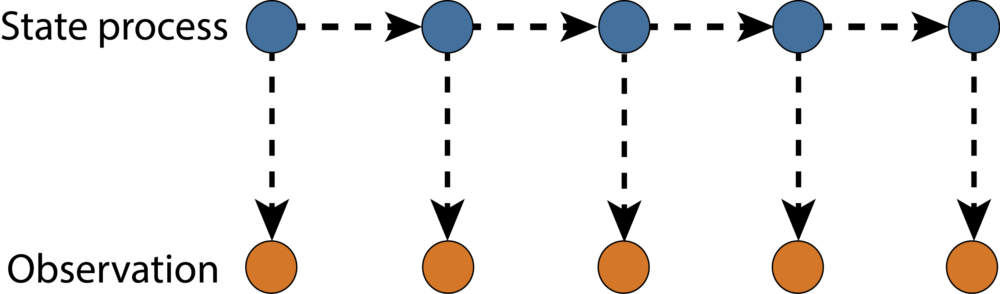

```{r setup, include=FALSE}
options(htmltools.dir.version = FALSE)
knitr::opts_chunk$set(echo = FALSE, fig.align = 'center', warning=FALSE, message=FALSE)
library(WILD6900)
# library(gganimate)
```

## Readings

> Kéry & Schaub 115-131

---
## Ecological state variables

#### **State variables** are the ecological quantities of interest in our model that change over space or time  

--
#### Abundance 

> the number of individual organisms in a population at a particular point in time   


--

#### Occurence

> the spatial distribution of organisms with a particular region at a particular point in time  

--
 
#### Richness

> the number of co-occuring species at a given location and a particular point in time  

???

$^2$ These are not the only state variables, but are among the most common in ecological studies

---
## Ecological parameters

#### **Parameters** determine how the state variables change over space and time

--
- Survival  
<br/>

--
- Reproduction  
<br/>

--
- Movement  
<br/>

--
- Population growth rate  
<br/>

--
- Carrying capacity  
<br/>

--
- Colonization/extinction rate  

---
## Process models
<br/>

$$\Huge [z|g(\theta_p, x), \sigma^2_p]$$
<br/>

- Mathematical description of our hypothesis about how the *state variables* we are interested in change over space and time  
<br/>

--
- Represent the **true** value of our state variables at any given point in space or time  
<br/>

--
- Deterministic  
<br/>

--
- Abstraction  

---
## Observation models

- Rarely observe the true state perfectly  

    + Animals are elusive and may hide from observers  
    + Even plants may be cryptic and hard to find  
    + Measurements may be taken with error  
    + May count the same individual > 1


--
- *Observation uncertainty* $\large (\sigma^2_o)$ can lead to biased estimates of model parameters, so generally requires its own model  
<br/>

$$\Huge [y_i|d(\Theta_o,z_i), \sigma^2_o]$$

---
class: inverse, middle, center

# State-space models

---
## State-space models

- Hierarchical models  

--
- Decompose time series into:  

    + process variation in state process  
    + observation error  

--
- Generally used for *Markovian* state process models  

    + Population dynamics  
    + Survival  
    + Occupancy  
    

```{r out.width="45%"}

```

---
## Process models

#### Population dynamics

- $\Large N_{t+1} \sim Poisson(N_t \lambda)$  

- $\Large N_{t+1} \sim Normal(N_t e^{\bigg[r_0 \bigg(1-\frac{N_t}{K}\bigg)\bigg]}, \sigma^2)$  


--
#### Survival

- $\Large z_{t+1} \sim Bernoulli\big(z_t \phi_t\big)$  


--
#### Occupancy

- $\Large z_{t+1} \sim Bernoulli\bigg(z_t (1-\epsilon_t) + (1 - z_t)\gamma_t\bigg)$  

---
## Observation models

#### Population dynamics

- $\Large C_{t} \sim Normal(N_t, \sigma_o^2)$  

- $\Large C_{t} \sim Binomial(N_t, p)$  


--
#### Survival

- $\Large y_{t} \sim Bernoulli\big(z_t p\big)$  


--
#### Occupancy

- $\Large y_{t} \sim Bernoulli\big(z_t p_t\big)$ 

---
## Including covariates

#### For any of these models, we can use GLMs to include covariates effects on parameters:

$$\Large log(\lambda_t) = \alpha + \mathbf \beta \mathbf X + \varepsilon_t$$

$$\Large logit(\phi_t/\gamma_t/\epsilon_t/p_t) = \alpha + \mathbf \beta \mathbf X + \varepsilon_t$$

--
#### And random effect structure

--
$$\Large \varepsilon_t \sim normal\big(0, \tau_{\lambda}\big)$$

$$\Large \tau_{\lambda} \sim gamma\big(0.25, 0.25\big)$$
---
## Simple state-space population growth model

#### Process model
$$\Large N_{t+1} = N_t \lambda_t$$

$$\Large \lambda_t \sim normal(\mu_{\lambda}, \tau_{\lambda})$$

--
#### Observation model
$$\Large C_{t} = N_t + \epsilon_t$$

$$\Large \epsilon_t\sim Normal(0, \sigma_o^2)$$

---
## Simple state-space population growth model

```{r include=FALSE}
set.seed(61)
n.years <- 25           # Number of years
N1 <- 30                # Initial population size
mean.lambda <- 1.02     # Mean annual population growth rate
sigma2.lambda <- 0.02   # Process (temporal) variation of the growth rate
sigma2.y <- 20          # Variance of the observation error

y <- N <- numeric(n.years)
N[1] <- N1
lambda <- rnorm(n.years-1, mean.lambda, sqrt(sigma2.lambda))
for (t in 1:(n.years-1)){
   N[t+1] <- N[t] * lambda[t]
   }

for (t in 1:n.years){
   y[t] <- rnorm(1, N[t], sqrt(sigma2.y))
   }

# Bundle data
jags.data <- list(y = y, T = n.years)

# Initial values
inits <- function(){list(sigma.proc = runif(1, 0, 5), mean.lambda = runif(1, 0.1, 2), sigma.obs = runif(1, 0, 10), N.est = c(runif(1, 20, 40), rep(NA, (n.years-1))))} 

# Parameters monitored
parameters <- c("lambda", "mean.lambda", "sigma2.obs", "sigma2.proc", "N.est")

# MCMC settings
ni <- 25000
nt <- 3
nb <- 10000
nc <- 3

# Call WinBUGS from R (BRT <1 min)
ssm <- jagsUI::jags(data = jags.data, inits = inits, parameters.to.save = parameters, 
                    model.file = "ssm.jags", n.chains = nc, n.thin = nt, 
                    n.iter = ni, n.burnin = nb)

df <- data.frame(Year = seq(1:length(N)), True = N, Observed = y, 
                 Estimated = ssm$mean$N.est, LCI = ssm$q2.5$N.est, UCI = ssm$q97.5$N.est)
```

```{r fig.width=7, fig.height=6}
(p <- ggplot() + 
  geom_line(data = df, aes(x = Year, y = True), color = WILD6900_colors$value[WILD6900_colors$name=="warning"]) +
  geom_line(data = df, aes(x = Year, y = Observed), color = WILD6900_colors$value[WILD6900_colors$name=="primary"], linetype = "dashed") +
     geom_point(data = df, aes(x = Year, y = Observed), color = "white", size = 5) +
  geom_point(data = df, aes(x = Year, y = Observed), color = WILD6900_colors$value[WILD6900_colors$name=="primary"]) +
   scale_y_continuous("N"))
```

---
## Simple state-space population growth model

```{r fig.width=7, fig.height=6}
p +
  geom_ribbon(data = df, aes(x = Year, ymin = LCI, ymax = UCI), fill = "grey20", alpha = 0.1) + 
  geom_line(data = df, aes(x = Year, y = Estimated), 
            color = WILD6900_colors$value[WILD6900_colors$name=="danger"]) 
```

---
## Simple state-space population growth model

#### What if instead of:

$$\Large C_{t} = N_t + \epsilon_t$$

$$\Large \epsilon_t\sim Normal(0, \sigma_o^2)$$

--
#### The observation model is:

$$\Large C_{t} \sim binomial(N_t, p)$$

#### and

$$\Large N_t = 50$$

---
## Systematic bias in state-space models

```{r include = FALSE}
N <- rep(50, n.years) 

p <- 0.7
y <- numeric(n.years)
for (t in 1:n.years){
   y[t] <- rbinom(1, N[t], p)
   }
y

# Bundle data
jags.data <- list(y = y, T = n.years)

# Initial values
inits <- function(){list(sigma.proc = runif(1, 0, 5), mean.lambda = runif(1, 0.1, 2), sigma.obs = runif(1, 0, 10), N.est = c(runif(1, 30, 60), rep(NA, (n.years-1))))}

# Parameters monitored
parameters <- c("lambda", "mean.lambda", "sigma2.obs", "sigma2.proc", "N.est")

# MCMC settings
ni <- 25000
nt <- 3
nb <- 10000
nc <- 3

# Call WinBUGS from R (BRT <1 min)
ssm <- jagsUI::jags(jags.data, inits, parameters, "ssm.jags", n.chains = nc, n.thin = nt, n.iter = ni, n.burnin = nb)

df2 <- data.frame(Year = seq(1:length(N)), True = 50, Observed = y, 
                 Estimated = ssm$mean$N.est, LCI = ssm$q2.5$N.est, UCI = ssm$q97.5$N.est)
```

```{r fig.width=7, fig.height=6}
(p <- ggplot() + 
  geom_line(data = df2, aes(x = Year, y = True), color = WILD6900_colors$value[WILD6900_colors$name=="warning"]) +
  geom_line(data = df2, aes(x = Year, y = Observed), color = WILD6900_colors$value[WILD6900_colors$name=="primary"]) +
   scale_y_continuous("N"))
```

---
## Systematic bias in state-space models

```{r fig.width=7, fig.height=6}
p +
  geom_ribbon(data = df2, aes(x = Year, ymin = LCI, ymax = UCI), fill = "grey20", alpha = 0.1) + 
  geom_line(data = df2, aes(x = Year, y = Estimated), 
            color = WILD6900_colors$value[WILD6900_colors$name=="danger"]) 
```

---
## Systematic bias in state-space models

#### What if instead of:

$$\Large C_{t} \sim binomial(N_t, p)$$

--
#### The observation model is:

$$\Large C_{t} \sim binomial(N_t, p_t)$$

#### and

$$\Large logit(p_{t}) = \alpha + \beta \times year_t$$

---
## Systematic bias in state-space models

```{r include = FALSE}
N <- rep(50, n.years)

lp <- -0.5 + 0.1*(1:n.years)  # Increasing trend of logit p
p <- plogis(lp)
y <- numeric(n.years)
for (t in 1:n.years){
   y[t] <- rbinom(1, N[t], p[t])
   }

# Bundle data
jags.data <- list(y = y, T = n.years)

# Call WinBUGS from R (BRT <1 min)
ssm2 <- jagsUI::jags(jags.data, inits, parameters, "ssm.jags", n.chains = nc, n.thin = nt, n.iter = ni, n.burnin = nb)

df3 <- data.frame(Year = seq(1:length(N)), True = 50, Observed = y, 
                 Estimated = ssm2$mean$N.est, LCI = ssm2$q2.5$N.est, UCI = ssm2$q97.5$N.est)
```

```{r fig.width=7, fig.height=6}
(p <- ggplot() + 
  geom_line(data = df3, aes(x = Year, y = True), color = WILD6900_colors$value[WILD6900_colors$name=="warning"]) +
  geom_line(data = df3, aes(x = Year, y = Observed), color = WILD6900_colors$value[WILD6900_colors$name=="primary"]) +
   scale_y_continuous("N"))
```

---
## Systematic bias in state-space models

```{r fig.width=7, fig.height=6}
p +
  geom_ribbon(data = df3, aes(x = Year, ymin = LCI, ymax = UCI), fill = "grey20", alpha = 0.1) + 
  geom_line(data = df3, aes(x = Year, y = Estimated), 
            color = WILD6900_colors$value[WILD6900_colors$name=="danger"]) 
```

---
## State-space models

#### Produce unbiased estimates of $\Large N$ **only** when false-positives and false-negatives cancel each other out on average  
<br/>

--
#### Produce unbiased estimates of population **indices** $\Large (Np)$ if detection probability has no pattern ove time  
<br/>

--
#### Do **not** produce unbiased estimates of $\Large N$ or $\Large Np$ if their are temporal patterns in detection probability or false-positive rates 

---
## State-space models

#### Advantages  

- explicit decomposition of process and observation models  

- flexible  

- mechanistic "smoothing" of process model  

- latent state (and uncertainty) can be monitored  

- possible to "integrate" data on state/observation parameters


#### Disadvantages

- computationally intensive  

- usually produce biased estimates of $N$  

